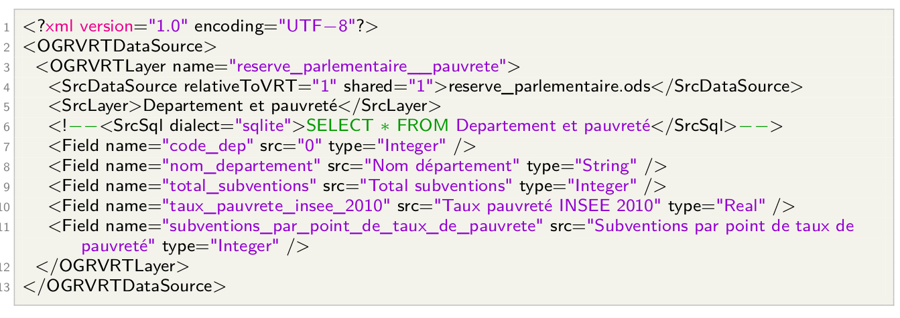
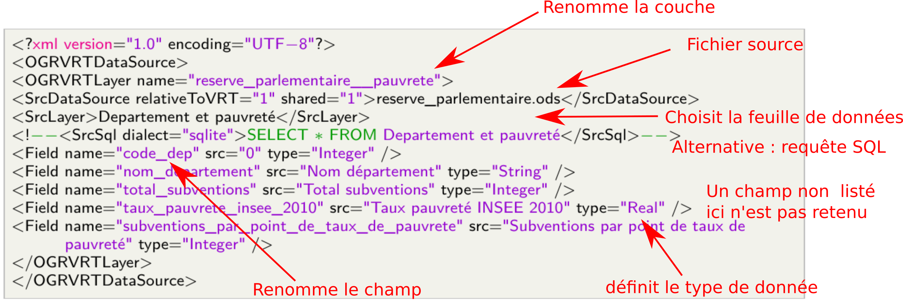

# Présentation rapide de la librairie GDAL/OGR et du format VRT

## GDAL/OGR

- https://gdal.org/
- Une librairie *opensource*, largement utilisée (sous le capot) par de nombreux outils y compris propriétaires
- Traitement de données géospatiales
- Essentiellement des supports entrées/sortie : un nombre incroyable de formats supportés
- Des outils en ligne de commande :
  - Support raster : [GDAL](https://gdal.org/programs/index.html#raster-programs)
  - Support Vecteur : [OGR](https://gdal.org/programs/index.html#vector-programs)
  - A noter l'arrivée d'une refonte massive des commandes GDAL/OGR à partir de GDAL 3.12 : [application gdal](https://gdal.org/en/stable/programs/index.html#gdal-application)

## VRT

- Un format interne de GDAL/OGR
- Plus connu pour sa version raster, mais **existe aussi pour des données vectorielles et tabulaires** : 
- https://gdal.org/drivers/vector/vrt.html
- OGR VRT, ça vous permet notamment de :
  - Faire l’économie d’un ETL
  - Autonomiser vos collègues amateurs d’Excel (et donc alléger votre charge de travail)
  - Augmenter la reproductibilité de vos flux de traitement de données
  - Automatiser vos flux de traitement de données
  - Frimer pendant une soirée (de géomaticiens)
- Supporté par QGIS
- Pas limité aux données tabulaires, loin de là. Mais les supporte
- Fichier XML, de configuration de la source de données. Permet de :
  - renommer des champs
  - changer le type des champs (entier, réel, date, texte)
  - ne conserver qu’un sous-ensemble des champs
  - choisir les champs définissant la géométrie (si présents)
  - filtrer le jeu de données via une requête SQL
  - découper sur une étendue via une requête SQL
  - reprojeter un jeu de données
  - fusionner plusieurs sources
  - charger des sources de données en ligne

### Un exemple de fichier VRT simple



### Exemple expliqué



- On définit la source de données
- On renomme les champs
- On publie le VRT (via QGIS ou ogr2ogr)

### Conditions de fonctionnement

- Encodage UTF-8
- Pas de fusion de cellules
- Une vraie donnée tabulaire (pas de mise en forme)

### Obtenir un VRT de départ

Pour créer votre fichier VRT, vous avez le choix. Vous pouvez :

- L’écrire à la main, grâce à la doc (vite pénible)
- Le générer via QGIS et l’extension Spreadsheet Layer : génère un fichier VRT à côté du fichier ouvert. Supporte XLS, XSLX, ODS, CSV
- Le générer en ligne de commande via [ogr2vrt_simple](https://github.com/jeanpommier/ogr2vrt_simple)
- Depuis GDAL 3.6, un script ogr2vrt est livré avec la librairie, *mais il faut le trouver car il n'est pas mis en avant (et un chouilla limité à mon goût)*.

# Quelques astuces avec OGR

## ogrinfo : inspecter une donnée vecteur

Sans option, ogrinfo renvoie très peu d'infos. La liste des couches contenues par la source de données

J'aime souvent récupérer plus d'infos que ça, mais pas trop. 

```
ogrinfo -so -al macouche.gpkg
```
marche bien

L'air de rien, ça vous permet de récupérer pas mal d'infos, sans avoir à ouvrir QGIS, charger la couche, ouvrir les propriétés etc : ouvrez une ligne de commande, et vous pouvez inspecter votre donnée, après chaque changement, facilement, sans toucher la souris.

### Exécuter des commandes sql
On peut aussi exécuter des commandes SQL sur une couche de données. Par exemple, un truc du genre : 
```
ogrinfo -al -where "NAME10 LIKE '%NY'" tl_2013_us_uac10.shp
```
```
ogrinfo -al -sql "SELECT * FROM tl_2013_us_uac10 WHERE UACE10 = '16171'" tl_2013_us_uac10.shp
```

## ogr2ogr : le couteau suisse

On peut presque tout faire avec ogr2ogr. Voir [la doc](https://gdal.org/programs/ogr2ogr.html), c'est important.

QQ commandes très fréquemment utilisées (par moi en tous cas) : 

### Afficher dans la console le contenu de la couche
Pratique pour explorer le contenu d'une donnée
```
ogr2ogr -f CSV /vsistdout/ monfichier.gpkg couche1 | more
```
(`| more` ajoute la pagination : vos données sont affichées page par page, on fait défiler en appuyant sur espace. On quitte le mode pagination avec `q`)

### Publier une donnée en base (postgresql).

Pour alléger la ligne de commande, j'utilise des variables d'environnement pour déclarer les paramètres de connexion. Je ne les ai pas nommées au hasard. Pour que psql et ogr les reconnaissent, il faut suivre une convention. Cf. [la doc libPQ](https://docs.postgresql.fr/15/libpq-envars.html).

Il suffit de les déclarer une fois tant qu'on ne change pas de console (sinon on doit recommencer)

_Ajustez les valeurs si besoin_
```
export PGPASSWORD=secret  # Remplacer par le vrai mdp bien sûr
# Et pour simplifier les paramètres de connexion, on peut faire pareil avec le reste : 
export PGDATABASE=cpgeom
export PGUSER=cpgeom
export PGHOST=localhost
```

On aurait aussi pu écrire un fichier .pgpass comme documenté dans [la doc libPQ](https://docs.postgresql.fr/15/libpq-pgpass.html).

```
ogr2ogr -f PostgreSQL PG:"host='$PGHOST' user='$PGUSER' dbname='$PGDATABASE'" \ 
  -progress -nln "roads" -nlt PROMOTE_TO_MULTI -lco OVERWRITE=YES \
  -lco SCHEMA=destschema monfichier.gpkg couche1
```

Ici, on a utilisé qq options en plus :

  - `-nln` pour nommer la table
  - `-lco OVERWRITE=YES` pour remplacer le contenu
  - `-lco SCHEMA=destschema` pour désigner le schema de destination (et ne pas publier dans `public`)
  
Et puis comme j'ai dit : [voir la doc](https://gdal.org/programs/ogr2ogr.html) 
